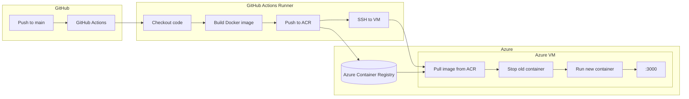

# Home Library Management Server

- 본 프로젝트는 집에 있는 다양한 서적들을 효율적으로 관리할 수 있도록 도와줍니다.
- 집에 있는 도서들에 대한 독후감과 평가를 할 수 있는 기능을 비롯하여, 내가 완독하였던 책들의 목록을 가져옵니다.

## 배포 with GitHub Actions

- 본 프로젝트는 GitHub Actions를 이용하여 커밋 시 자동으로 Azure에 배포됩니다.
- Azure Container Registry에 이미지를 푸시하고, Azure VM에 SSH로 접속하여 컨테이너를 업데이트하는 방식으로 배포됩니다.

### 배포 흐름

### 브랜치 전략

| 브랜치 | 용도 | 트리거 |
|--------|------|--------|
| `main` | 프로덕션 배포 | push 시 Azure VM 자동 배포 |
| `develop` | 개발 | push 시 빌드/테스트만 실행 |

